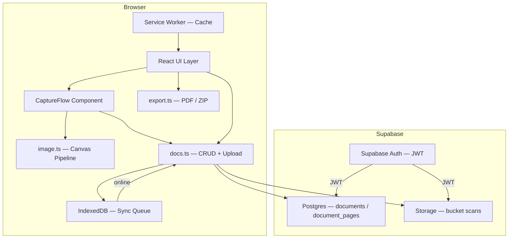
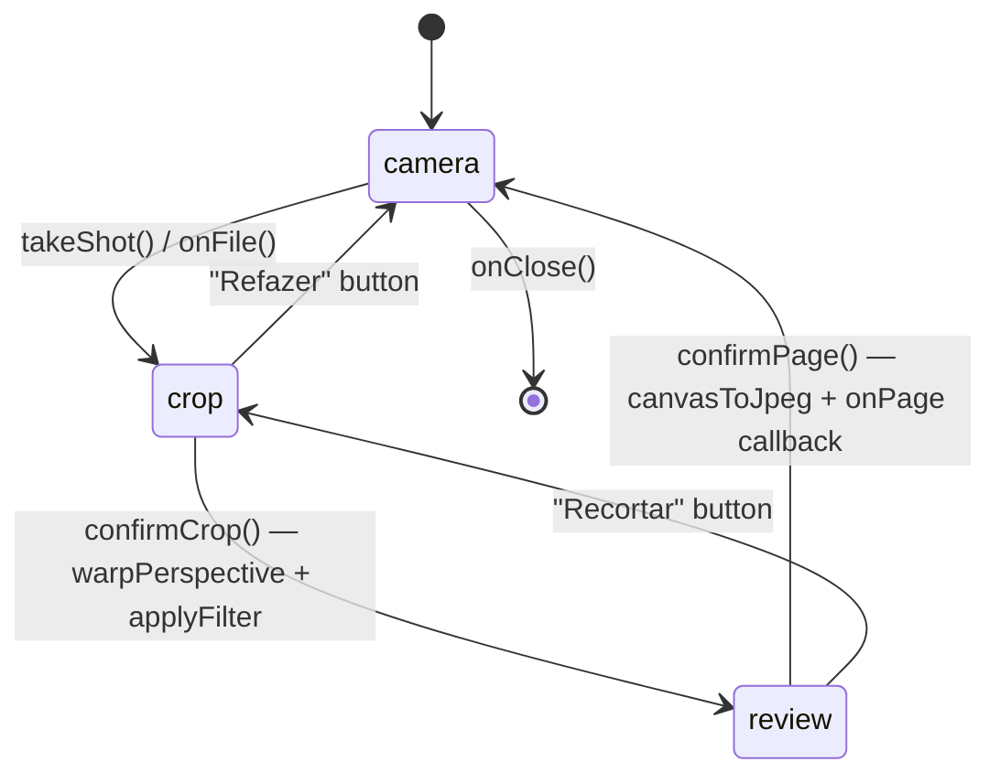
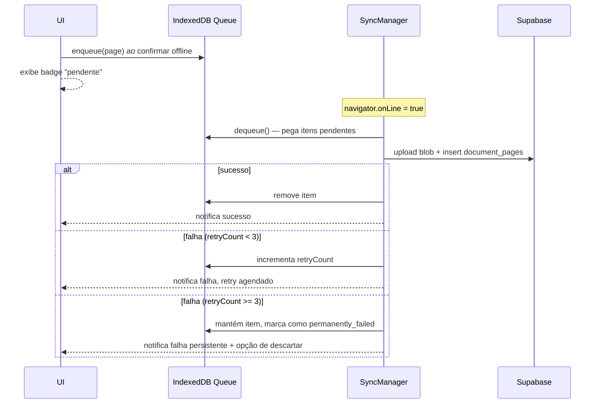

# Design Document — DocScan

## Overview

DocScan é um PWA instalável para digitalização de documentos, posicionado como alternativa gratuita ao CamScanner. O aplicativo captura páginas pela câmera do dispositivo, aplica correção de perspectiva e filtros de imagem inteiramente no cliente, organiza o resultado em documentos multi-página e exporta em PDF ou JPEG. Os documentos são sincronizados na nuvem via Supabase Auth + Postgres + Storage e o app funciona offline com uma fila de sincronização em IndexedDB.

### Objetivos de design

| Objetivo | Estratégia |
|---|---|
| Privacidade de dados | Todo processamento de imagem ocorre no browser; pixels nunca saem do cliente exceto para o Supabase Storage do próprio usuário |
| Performance mobile | Canvas APIs síncronas, sem deps pesadas no caminho crítico de captura |
| Resiliência offline | IndexedDB como fila durável; sync automático ao reconectar |
| Simplicidade de stack | React + Vite + TanStack Router + Supabase — sem servidor dedicado |
| PWA instalável | manifest.webmanifest + Service Worker com cache estático completo |

### Stack existente

- **Framework**: React 19 + TanStack Start (Vite) + TypeScript
- **Roteamento**: TanStack Router (`/auth`, `/docs`, `/scan`, `/doc/$id`)
- **Backend**: Supabase (Auth, Postgres, Storage — bucket `scans`)
- **Processamento de imagem**: canvas nativo — `detectQuad`, `warpPerspective`, `applyFilter`, `rotateCanvas`, `canvasToJpeg` (em `src/lib/scan/image.ts`)
- **Gerenciamento de documentos**: `src/lib/scan/docs.ts`
- **Exportação**: `pdf-lib` via `src/lib/scan/export.ts`
- **UI**: Tailwind CSS v4 + Radix UI + sonner (toasts) + lucide-react

---

## Architecture

### Visão geral de alto nível



### Camadas de responsabilidade

| Camada | Módulo | Responsabilidade |
|---|---|---|
| UI / Rotas | `src/routes/*.tsx` | Composição de telas, navegação, estado local de UI |
| Captura | `CaptureFlow.tsx` | Máquina de estados câmera → recorte → revisão |
| Processamento de imagem | `src/lib/scan/image.ts` | Funções puras de canvas: detectQuad, warpPerspective, applyFilter, rotateCanvas, canvasToJpeg |
| Gerenciamento de docs | `src/lib/scan/docs.ts` | CRUD no Postgres + upload/download no Storage |
| Exportação | `src/lib/scan/export.ts` | buildPdf (pdf-lib), shareOrDownload (Web Share API), safeFileName |
| Sync offline | `src/lib/scan/offline.ts` (a implementar) | Fila de sincronização em IndexedDB, retry com backoff |
| OCR | `src/lib/scan/ocr.ts` (a implementar) | Tesseract.js worker — processamento local |
| Auth guard | `src/hooks/use-auth-guard.ts` | Redirecionamento para `/auth` quando sem sessão |
| PWA | `public/manifest.webmanifest` + `src/service-worker.ts` (a implementar) | Instalação, cache de assets, update prompt |

### Fluxo de captura (estados)



### Fluxo offline de sincronização



---

## Components and Interfaces

### `CaptureFlow` (`src/components/scan/CaptureFlow.tsx`) — existente

```typescript
type CaptureStage = "camera" | "crop" | "review";

type CapturedPage = {
  id: string;
  blob: Blob;          // JPEG quality 0.85
  width: number;
  height: number;
  previewUrl: string;  // object URL, deve ser revogado pelo consumidor
};

interface CaptureFlowProps {
  onPage: (page: CapturedPage) => void;
  onClose: () => void;
}
```

**Invariante de design**: o componente é stateful mas não faz I/O de rede. Toda persistência é responsabilidade do consumidor via `onPage`.

### `image.ts` — funções de canvas (existente)

```typescript
type Point = { x: number; y: number };
type Quad = [Point, Point, Point, Point]; // tl, tr, br, bl
type FilterKind = "color" | "gray" | "bw" | "enhance";

function detectQuad(source: HTMLCanvasElement): Quad
function warpPerspective(source: HTMLCanvasElement, quad: Quad): HTMLCanvasElement
function applyFilter(source: HTMLCanvasElement, kind: FilterKind): HTMLCanvasElement
function rotateCanvas(source: HTMLCanvasElement, degrees: number): HTMLCanvasElement
function canvasToJpeg(canvas: HTMLCanvasElement, quality?: number): Promise<Blob>
function loadImageToCanvas(src: string | Blob): Promise<HTMLCanvasElement>
function outputSize(quad: Quad, max?: number): { width: number; height: number }
```

### `docs.ts` — gerenciamento de documentos (existente)

```typescript
type ScanPage = {
  id: string;
  document_id: string;
  position: number;
  storage_path: string; // {userId}/{documentId}/{uuid}.jpg
  width: number;
  height: number;
  url: string;          // signed URL (TTL 3600s)
};

type ScanDocument = {
  id: string;
  name: string;
  updated_at: string;
  pageCount: number;
  thumbnail: string | null; // signed URL or null
};

type NewPage = { blob: Blob; width: number; height: number };

// Funções existentes
function listDocuments(search?: string): Promise<ScanDocument[]>
function getDocument(id: string): Promise<{ id, name, updated_at, pages: ScanPage[] } | null>
function createDocument(name: string, pages: NewPage[]): Promise<string>
function addPages(documentId: string, pages: NewPage[], startAt: number): Promise<void>
function touchDocument(documentId: string): Promise<void>
function renameDocument(documentId: string, name: string): Promise<void>
function deleteDocument(documentId: string): Promise<void>
function deletePage(page: ScanPage): Promise<void>
function reorderPages(documentId: string, orderedIds: string[]): Promise<void>
function replacePageImage(page: ScanPage, blob: Blob, width: number, height: number): Promise<void>
```

### `export.ts` (existente)

```typescript
function buildPdf(name: string, pages: ScanPage[]): Promise<Blob>
function shareOrDownload(blob: Blob, filename: string): Promise<"shared" | "downloaded">
function downloadBlob(blob: Blob, filename: string): void
function safeFileName(name: string): string
```

### `offline.ts` — fila de sincronização (a implementar)

```typescript
type SyncStatus = "pending" | "retrying" | "permanently_failed";

type SyncQueueItem = {
  id: string;             // crypto.randomUUID()
  documentId: string;
  blob: Blob;
  width: number;
  height: number;
  position: number;
  capturedAt: number;     // Date.now()
  retryCount: number;
  status: SyncStatus;
};

// IDB object store: "sync_queue", keyPath: "id"
function enqueue(item: Omit<SyncQueueItem, "id" | "retryCount" | "status" | "capturedAt">): Promise<string>
function dequeue(): Promise<SyncQueueItem[]>     // retorna itens status !== permanently_failed
function markSynced(id: string): Promise<void>   // remove da fila
function markFailed(id: string): Promise<void>   // incrementa retryCount; status → permanently_failed se >= 3
function discardItem(id: string): Promise<void>  // remove forçado pelo usuário
function getPendingCount(): Promise<number>      // retorna count de itens pending + retrying
```

### `ocr.ts` — reconhecimento óptico (a implementar)

```typescript
// Tesseract.js v5 worker — carregado sob demanda, processamento local
function runOcr(page: ScanPage, signal?: AbortSignal): Promise<string>
// Throws OcrTimeoutError se exceder 60s
// Throws OcrError para demais falhas
// Persiste resultado em document_pages.ocr_text via updatePageOcrText()
```

---

## Data Models

### Postgres — esquema existente

```sql
-- tabela: documents
CREATE TABLE public.documents (
  id         UUID PRIMARY KEY DEFAULT gen_random_uuid(),
  user_id    UUID NOT NULL REFERENCES auth.users ON DELETE CASCADE,
  name       TEXT NOT NULL DEFAULT 'Documento',
  created_at TIMESTAMPTZ NOT NULL DEFAULT now(),
  updated_at TIMESTAMPTZ NOT NULL DEFAULT now()
);
-- trigger: update_documents_updated_at → updated_at = now() on UPDATE

-- tabela: document_pages
CREATE TABLE public.document_pages (
  id           UUID PRIMARY KEY DEFAULT gen_random_uuid(),
  document_id  UUID NOT NULL REFERENCES documents(id) ON DELETE CASCADE,
  user_id      UUID NOT NULL REFERENCES auth.users ON DELETE CASCADE,
  position     INTEGER NOT NULL DEFAULT 0,
  storage_path TEXT NOT NULL,   -- {userId}/{documentId}/{uuid}.jpg
  width        INTEGER NOT NULL DEFAULT 0,
  height       INTEGER NOT NULL DEFAULT 0,
  created_at   TIMESTAMPTZ NOT NULL DEFAULT now()
);
```

### Extensão para OCR (a implementar via migration)

```sql
-- adicionar campo ocr_text em document_pages
ALTER TABLE public.document_pages ADD COLUMN IF NOT EXISTS ocr_text TEXT;

-- índice full-text para busca por conteúdo de página
CREATE INDEX IF NOT EXISTS document_pages_ocr_fts
  ON public.document_pages
  USING gin(to_tsvector('portuguese', coalesce(ocr_text, '')));
```

### RLS (Row-Level Security) — existente

```sql
-- documents: usuário gerencia apenas seus próprios registros
CREATE POLICY "Users manage own documents" ON public.documents
  FOR ALL TO authenticated
  USING (auth.uid() = user_id) WITH CHECK (auth.uid() = user_id);

-- document_pages: mesmo padrão
CREATE POLICY "Users manage own pages" ON public.document_pages
  FOR ALL TO authenticated
  USING (auth.uid() = user_id) WITH CHECK (auth.uid() = user_id);

-- Storage (bucket scans): path-based ownership — {userId}/...
-- Policies em storage.objects verificam (storage.foldername(name))[1] = auth.uid()::text
```

### Storage — convenções de path

```
scans/
└── {userId}/
    └── {documentId}/
        └── {uuid}.jpg    ← arquivo de página
```

### IndexedDB — sync queue (a implementar)

```
DB name: docscan-offline
version: 1

object store: sync_queue
  keyPath: id
  indexes:
    - status (non-unique)
    - documentId (non-unique)
    - capturedAt (non-unique)
```

### Roteamento

| Rota | Componente | Protegida |
|---|---|---|
| `/auth` | Auth screen | não (guest-only redirect) |
| `/docs` | Biblioteca | sim |
| `/scan` | Nova digitalização | sim |
| `/doc/$id` | Detalhes do documento | sim |
| `/` | Leitor PDF (feature separada) | sim |

---

## Correctness Properties

*A property is a characteristic or behavior that should hold true across all valid executions of a system — essentially, a formal statement about what the system should do. Properties serve as the bridge between human-readable specifications and machine-verifiable correctness guarantees.*

### Property 1: detectQuad retorna vértices dentro dos limites do canvas

*Para qualquer* canvas válido de dimensões w × h, a função `detectQuad` deve retornar um Quad onde todos os 4 vértices têm `x ∈ [0, w]` e `y ∈ [0, h]`.

**Validates: Requirements 2.1, 2.2, 2.3**

---

### Property 2: Quad de fallback posiciona vértices com inset de 6%

*Para qualquer* canvas de dimensões w × h onde `detectQuad` não encontra bordas convincentes (área do quad < 25% da área do canvas), o Quad retornado deve ter vértices posicionados com recuo de exatamente 6% de cada borda: tl = (0.06w, 0.06h), tr = (0.94w, 0.06h), br = (0.94w, 0.94h), bl = (0.06w, 0.94h).

**Validates: Requirements 2.2, 2.3**

---

### Property 3: Quad válido é não-auto-intersectante e tem área positiva

*Para qualquer* Quad submetido à validação antes de `warpPerspective`, o sistema deve aceitar apenas Quads que sejam não-auto-intersectantes e com área > 0, e rejeitar todos os demais.

**Validates: Requirements 3.3, 3.4**

---

### Property 4: Rotação de 360° preserva dimensões originais do canvas

*Para qualquer* canvas de dimensões w × h, aplicar `rotateCanvas(canvas, 90)` quatro vezes em sequência deve produzir um canvas com as mesmas dimensões w × h do original.

**Validates: Requirements 7.3**

---

### Property 5: Validação de nome de documento rejeita strings inválidas

*Para qualquer* string fornecida como nome de documento, o sistema deve rejeitar a persistência se a string contém menos de 1 caractere não-espaço ou mais de 100 caracteres, e aceitar em todos os demais casos.

**Validates: Requirements 6.5**

---

### Property 6: safeFileName produz nome de arquivo válido para qualquer string de entrada

*Para qualquer* string de entrada não-vazia, `safeFileName` deve retornar uma string não-vazia contendo apenas caracteres `[a-zA-Z0-9\-_ ]` (sem caracteres especiais, sem acentos, sem separadores de caminho).

**Validates: Requirements 9.1, 9.2**

---

### Property 7: Reordenação de páginas produz a sequência correta de posições

*Para qualquer* lista de páginas e *para qualquer* operação de mover uma página da posição `from` para a posição `to`, o array resultante deve conter exatamente as mesmas páginas na nova ordem esperada, com cada página na posição do índice correspondente.

**Validates: Requirements 7.1**

---

### Property 8: Fila offline registra todos os campos obrigatórios ao fazer enqueue

*Para qualquer* página confirmada enquanto offline, o item inserido na fila de sincronização (IndexedDB) deve conter `documentId`, `blob`, `width`, `height`, `position`, `capturedAt`, `retryCount = 0` e `status = "pending"`.

**Validates: Requirements 13.2**

---

### Property 9: markSynced remove o item da fila

*Para qualquer* item com id `i` presente na fila de sincronização, após `markSynced(i)` o item não deve mais estar presente na fila (`getPendingCount` decresce e `dequeue()` não retorna o item).

**Validates: Requirements 13.4**

---

### Property 10: markFailed incrementa retryCount e aplica threshold

*Para qualquer* item com `retryCount = n`, após `markFailed(id)`:
- Se `n + 1 < 3`: `retryCount` deve ser `n + 1` e `status` deve ser `"retrying"`
- Se `n + 1 >= 3`: `status` deve ser `"permanently_failed"` e o item não deve aparecer em `dequeue()`

**Validates: Requirements 13.5, 13.6**

---

### Property 11: Busca retorna apenas documentos cujo nome contém o termo (case-insensitive)

*Para qualquer* lista de documentos e *para qualquer* termo de busca não-vazio, `listDocuments(search)` deve retornar apenas documentos cujo `name.toLowerCase()` inclua `search.trim().toLowerCase()`, e nenhum documento que não satisfaça essa condição.

**Validates: Requirements 10.3**

---

### Property 12: OCR é idempotente — reprocessamento substitui texto anterior

*Para qualquer* página que já possua `ocr_text` armazenado, chamar `runOcr(page)` deve substituir o texto anterior pelo novo resultado, de modo que após duas chamadas sequenciais o campo `ocr_text` contenha exatamente o resultado da segunda chamada e não uma concatenação.

**Validates: Requirements 15.2, 15.5**

---

### Property 13: buildPdf gera um blob PDF válido para qualquer lista não-vazia de páginas

*Para qualquer* lista não-vazia de `ScanPage` com JEPGs válidos, `buildPdf` deve retornar um `Blob` com `type = "application/pdf"` e tamanho > 0, contendo o mesmo número de páginas que a lista de entrada.

**Validates: Requirements 8.1**

---

## Error Handling

### Princípios gerais

1. **Nunca perder dados do usuário**: erros no I/O de rede (upload, Postgres) não devem descartar imagens já processadas no cliente.
2. **Mostrar causa específica**: mensagens de erro devem identificar o contexto (ex.: "Não foi possível girar a página", não apenas "Erro").
3. **Rollback visual imediato**: em caso de falha de persistência, a UI retorna ao estado pré-operação (reordenação, renomeação, exclusão).
4. **Registro interno**: todos os erros não esperados (`detectQuad` exception, `warpPerspective` exception) são registrados via `console.error` ou serviço de logging sem bloquear o fluxo.

### Mapeamento de erros por domínio

| Domínio | Cenário de erro | Comportamento |
|---|---|---|
| Câmera | `getUserMedia` negado | Exibe mensagem de erro; habilita fallback galeria |
| Arquivo | Formato inválido ou > 20 MB | Exibe mensagem descritiva; permanece no estágio câmera |
| detectQuad | Exception | Aplica fallback quad; registra erro; não bloqueia |
| warpPerspective | Exception | Exibe erro; mantém usuário no estágio de recorte |
| canvasToJpeg | Falha | Exibe erro; mantém canvas processado no estágio de revisão |
| Upload Storage | Falha | Exibe erro; mantém dados da página disponíveis para retry |
| Postgres write | Falha | Exibe erro; rollback visual; registra internamente |
| OCR | Timeout (> 60s) | Exibe notificação de falha; mantém página sem texto |
| OCR | Erro geral | Mesmo que timeout |
| Sync offline | retryCount < 3 | Incrementa contador; agenda retry; notifica usuário |
| Sync offline | retryCount >= 3 | Marca permanently_failed; exibe notificação persistente + botão descartar |
| Signed URL | Falha ao gerar | Exibe ícone placeholder; não impede carregamento dos demais documentos |
| Auth | Sessão expirada | Detecta na próxima operação autenticada; exibe mensagem; redireciona para `/auth` |

### Estratégia de retry para sync offline

```
tentativa 1: imediata ao reconectar
tentativa 2: após 30s
tentativa 3: após 2min
>= 3 falhas: permanently_failed (usuário deve descartar manualmente)
```

---

## Testing Strategy

### Abordagem dual: testes de exemplo + propriedades

O sistema combina **testes de exemplo** (comportamento específico com inputs concretos) e **testes de propriedade** (invariantes universais sobre o espaço de inputs).

#### Testes de exemplo — cobertura por módulo

**image.ts**
- `detectQuad` com canvas em branco → retorna fallback inset
- `applyFilter("color")` retorna canvas com mesmas dimensões
- `canvasToJpeg` retorna Blob com `type = "image/jpeg"`
- `loadImageToCanvas` com URL de blob JPEG válido → canvas com dimensões corretas

**docs.ts** (com mock do supabase client)
- `createDocument` invoca `storage.upload` e `from("documents").insert`
- `deleteDocument` remove páginas do Storage antes de excluir o registro
- `reorderPages` atualiza `position` de cada página sequencialmente

**export.ts**
- `safeFileName` com string vazia → retorna `"documento"`
- `shareOrDownload` com Web Share API indisponível → invoca `downloadBlob`

**offline.ts** (a implementar)
- `enqueue` persiste item no IndexedDB com campos corretos
- `dequeue` não retorna itens `permanently_failed`
- `discardItem` remove item independente do status

**ocr.ts** (a implementar)
- `runOcr` com AbortSignal já abortado → rejeita imediatamente

#### Testes de propriedade (property-based testing)

**Biblioteca**: [fast-check](https://fast-check.dev/) — sem deps nativas, funciona no browser e no Node

**Configuração mínima**: 100 iterações por propriedade.

**Tag format**: `// Feature: doc-scan, Property N: <descrição>`

| Propriedade | Módulo alvo | Geradores |
|---|---|---|
| P1: detectQuad vértices dentro dos limites | `detectQuad` | `fc.nat()` para w, h; canvas sintético |
| P2: Quad fallback com inset 6% | `detectQuad` | canvas mínimo onde detecção falha |
| P3: Validação de Quad não-auto-intersectante | função `isValidQuad` | `fc.tuple` de 4 pontos 2D |
| P4: rotateCanvas 360° preserva dimensões | `rotateCanvas` | `fc.nat()` para w, h |
| P5: Validação de nome de documento | função `isValidDocName` | `fc.string()` com variação de comprimento |
| P6: safeFileName produz nome válido | `safeFileName` | `fc.string()` com caracteres arbitrários |
| P7: Reordenação produz sequência correta | lógica de reordenação | `fc.array` + `fc.integer` para from/to |
| P8: enqueue registra campos obrigatórios | `offline.ts::enqueue` | `fc.record` com campos de SyncQueueItem |
| P9: markSynced remove item | `offline.ts` | `fc.uuid()` para id |
| P10: markFailed aplica threshold | `offline.ts` | `fc.integer({ min: 0, max: 5 })` para retryCount inicial |
| P11: listDocuments filtra corretamente | lógica de filtro client-side | `fc.array(fc.record)` + `fc.string()` |
| P12: OCR é idempotente | `ocr.ts::updatePageOcrText` | `fc.string()` para texto OCR |
| P13: buildPdf gera PDF válido | `export.ts::buildPdf` | array de páginas com JPEG mock |

#### Testes de integração

Cobrindo critérios que dependem do Supabase (Auth, Postgres, Storage):

- Autenticação via e-mail/senha — fluxo completo com Supabase local
- RLS: usuário A não acessa documentos do usuário B
- Upload e download de blob via Storage
- Signed URL com expiração de 3600s
- Sync: página offline enfileirada → upload ao reconectar → removida da fila

#### Testes de smoke — PWA

- `manifest.webmanifest` contém campos obrigatórios (`name`, `short_name`, `icons`, `start_url`, `display: "standalone"`, `background_color`)
- Service Worker registrado após carregamento da página

### Cobertura de testes por requisito (mapeamento resumido)

| Requisito | Tipo de teste | Cobertura |
|---|---|---|
| Req 1 (Captura câmera) | Exemplo + integração | 1.2, 1.4 |
| Req 2 (Detecção bordas) | Propriedade | P1, P2 (cobre 2.1, 2.2, 2.3) |
| Req 3 (Ajuste perspectiva) | Propriedade + exemplo | P3 (cobre 3.3, 3.4) |
| Req 4 (Filtros) | Exemplo | 4.1, 4.3 |
| Req 5 (Confirmação página) | Propriedade + integração | P13 parcial; integração upload |
| Req 6 (Criação documento) | Exemplo + propriedade | P5 (6.5); exemplo 6.2 |
| Req 7 (Gerenciamento páginas) | Propriedade + exemplo | P4 (7.3), P7 (7.1); exemplos 7.5, 7.8 |
| Req 8 (Exportação PDF) | Propriedade | P13 (8.1) |
| Req 9 (Exportação imagens) | Propriedade + exemplo | P6 (9.1, 9.2) |
| Req 10 (Biblioteca) | Propriedade + exemplo | P11 (10.3); exemplos 10.4, 10.5, 10.8 |
| Req 11 (Autenticação) | Integração + exemplo | 11.3–11.7 |
| Req 12 (Cloud sync) | Integração | 12.1–12.6 |
| Req 13 (Offline) | Propriedade + integração | P8–P10 (13.2, 13.4–13.6); integração 13.3 |
| Req 14 (PWA) | Smoke | 14.1 |
| Req 15 (OCR) | Propriedade + exemplo | P12 (15.2, 15.5); exemplo 15.3 parcial |
| Req 16 (Segurança) | Integração + exemplo | 16.4; integração RLS |
